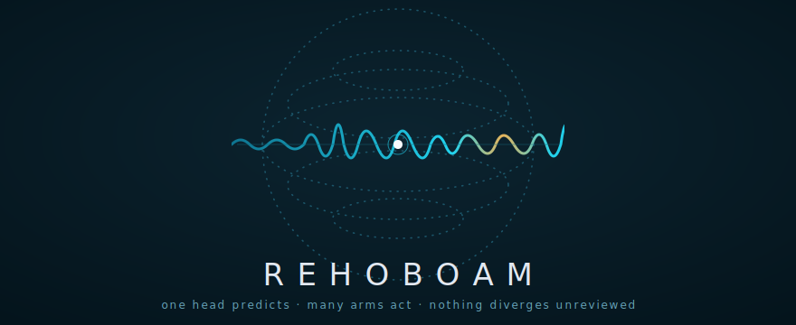

<p align="center">
  
</p>

<p align="center">
  <a href="LICENSE"></a>
  
  
  
</p>

# Brigade

*Formerly known as Rehoboam — the machine learned to cook.*

A multi-agent build orchestrator run like a professional kitchen, packaged
as a [Claude Code skill](https://docs.claude.com/en/docs/claude-code/skills).

**One chef writes the menu. A brigade cooks it. Nothing leaves the pass
untasted.**

> *A chef is essential in the kitchen. But putting him on dish duty or
> peeling potatoes is a waste — of talent, and of budget. Brigade runs your
> codebase the way Escoffier ran a kitchen in 1903: specialized roles,
> parallel stations, and a pass where every plate gets tasted before it
> goes out. Multi-agent orchestration, a century early.*
>
> — the Crypto Chef 👨‍🍳

- 👨‍🍳 **The Chef** — *the head.* A strong model that scouts the kitchen,
  writes the tickets, and **never peels the potatoes**: it doesn't write the
  implementation itself.
- 🔥 **The Brigade** — *the arms.* Parallel cooks (cheaper/faster models,
  **any provider**: Anthropic, OpenAI-compatible, Ollama), each firing one
  ticket at their own station (git worktree) when isolation is needed.
- 👅 **The Pass** — *the reviewer.* A fresh-palate judge that tastes the
  *real diff* and executes the acceptance criteria. Approves, or sends the
  dish back to the *same* cook (context preserved) for up to 2 refires.
- 🔔 **Service** — the chef's final end-to-end check: build, test,
  integrate, clean the kitchen.

```
USAGE:   /brigade <task to build>

you ─── /brigade "add rate limiting to the API"
 │
 ▼
┌──────────────────────────────────────────────────┐
│ 👨‍🍳 THE CHEF — executive chef (strong model)      │
│ scouts the kitchen · writes the tickets          │
│ never peels the potatoes                         │
└──────────────────────────────────────────────────┘
   │ ticket #1       │ ticket #2       │ ticket #n
   ▼                 ▼                 ▼
┌──────────┐    ┌──────────┐    ┌──────────┐    THE BRIGADE
│   cook   │    │   cook   │    │   cook   │    fires in parallel,
│   (any   │    │   (any   │    │   (any   │    stations (worktrees)
│ provider)│    │ provider)│    │ provider)│    if needed
└──────────┘    └──────────┘    └──────────┘
   │                 │                 │
   ▼                 ▼                 ▼
┌──────────────────────────────────────────────────┐
│ 👅 THE PASS (fresh palate)                       │
│ tastes the real diff · runs acceptance criteria  │
└──────────────────────────────────────────────────┘
   │ approve                    │ refire (max 2)
   ▼                            └─▶ back to the SAME cook,
┌────────────────────────────┐      context preserved
│ 👨‍🍳 CHEF — SERVICE          │
│ build · test · integrate   │
└────────────────────────────┘
   │
   ▼
🔔 summary: menu · tickets · verdicts · plates
```

## Why

Big tasks fail in single-agent runs for two boring reasons: the context
window fills up with implementation noise, and the model grades its own
homework. It's the one-man kitchen problem — the same person invents the
menu, cooks every course, *and* reviews the restaurant. Brigade splits the
roles apart: planning and cooking happen in different contexts, and tasting
happens in a context that has seen *nothing* except the ticket and the diff.
The pass can't be charmed by the cook's story about the dish, because it
never hears it — it only tastes the plate.

There's a cost angle too: paying frontier-model prices to have your
strongest model grep through boilerplate is paying the executive chef to
wash dishes. With Brigade the chef thinks once, briefly, at chef prices —
and the volume work runs on brigade-priced models.

## Glossary

| Kitchen | Engineering |
| ------------- | ----------------------------------------- |
| Menu          | The plan                                  |
| Ticket        | A self-contained brief / sub-task         |
| Cook          | A parallel executor agent                 |
| Station       | A git worktree (isolation)                |
| The pass      | The fresh-context reviewer                |
| Refire        | A revision round (max 2, same cook)       |
| 86'd          | Escalated to the user                     |
| Service       | The final end-to-end check + integration  |

## Install

```bash
# personal skills (available in every project)
git clone https://github.com/itboy79/brigade.git ~/.claude/skills/brigade

# — or — project-level (committed with the repo)
git clone https://github.com/itboy79/brigade.git .claude/skills/brigade
```

Or run the installer, which does the first form and verifies python3:

```bash
./install.sh
```

Then in Claude Code:

```
/brigade add rate limiting to the API
```

The skill also triggers on natural phrasing — "orchestrate this across
agents", "split this feature into parallel sub-tasks" — and still answers
to the legacy `/rehoboam`.

## Configuration

Per-repo config lives in `.brigade/config.json` (created from
[`assets/config.example.json`](assets/config.example.json) on first run;
a legacy `.rehoboam/config.json` is detected and migrated):

```jsonc
{
  "chef": { "provider": "anthropic", "model": "claude-fable-5" },
  "cook": { "provider": "anthropic", "model": "claude-sonnet-5" },
  "pass": { "provider": "ollama",    "model": "llama3.3:70b" },
  "max_parallel_cooks": 4,
  "max_refires": 2,
  "use_stations": "auto"   // auto | always | never
}
```

Any role can run on any provider — mixing them is encouraged: a pass on a
*different* provider than the cooks has an uncorrelated palate.

### Providers

| Provider    | How cooks fire                                             | Refire context        |
| ----------- | ---------------------------------------------------------- | --------------------- |
| `anthropic` | Native subagents, or `claude -p` (agentic: edits files)     | Session resume        |
| `openai`    | Codex CLI if present (agentic), else chat API in diff-mode  | Stateless replay      |
| `ollama`    | Local chat API in diff-mode                                 | Stateless replay      |

*Diff-mode:* a bare chat model can't touch the filesystem, so it returns
unified diffs and the chef applies them (`git apply --check` first — a diff
that doesn't apply is an automatic refire). Full adapter details, including
`OPENAI_BASE_URL` for Azure/Groq/Together/LM Studio, are in
[`references/providers.md`](references/providers.md).

## The intro

Every run opens at the pass — steam over the toque, tickets printing on the
rail, and the service bell (pure Python ANSI, zero dependencies, degrades
to a static frame when piped):

```bash
python3 scripts/brigade_intro.py
```

Set `BRIGADE_NO_ANIM=1` to always get the static frame.

## Repository layout

```
brigade/
├── SKILL.md                    # the orchestrator playbook (what Claude reads)
├── scripts/
│   └── brigade_intro.py        # kitchen-pass intro animation
├── references/
│   └── providers.md            # per-provider adapter invocations
├── assets/
│   └── config.example.json     # default .brigade/config.json
├── docs/
│   └── banner.svg              # the animated banner above
└── install.sh
```

## Design notes

- **The chef never cooks.** Its only outputs are the menu and the tickets
  (plus trivial, declared integration fixes at service). This keeps the
  planning context clean for the whole run.
- **Tickets are context-free.** Each one carries its own repo context, an
  explicit file scope, and objectively checkable acceptance criteria — a
  cook with zero conversation history must be able to fire it.
- **The pass tastes the plate, not the story.** The cook's self-report is
  never accepted as evidence; only the real diff is.
- **Refires go back to the same cook.** Context preservation (session
  resume or message replay) is what makes the second firing cheaper than
  the first.
- **Failure doctrine:** refire once on the same provider → fall back to the
  chef's provider → report everything in the summary. One burned dish never
  stops service.

## License

[MIT](LICENSE) — cooked by [Giorgio Gramegna](https://github.com/itboy79),
the Crypto Chef. **Cook the code. Ship the dish.** 👨‍🍳

*Escoffier invented multi-agent orchestration in 1903. We just added git
worktrees.*
